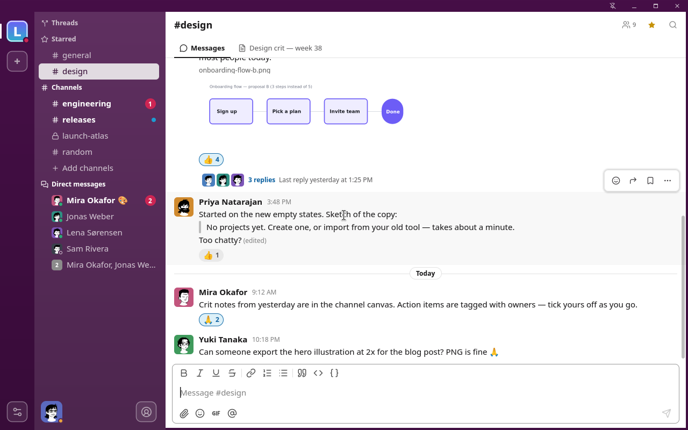

# Make Slack Great Again

A fast native Slack client built in C++, on its own platform, network and graphics layers: no Electron, no web view, no GUI toolkit.

## About

msga is a Slack client first and foremost. Channels, DMs, threads, reactions, files and notifications all work the way you expect from Slack, in a window that starts instantly and needs a fraction of the memory of the official app. As a side feature, msga can also show your Claude Code sessions in the same workspace rail, each one as a direct message.

Everything below the UI is msga's own code: a thin OS layer for windows, input and desktop services (Wayland and X11 on Linux, AppKit on macOS, Win32 on Windows), an HTTP and WebSocket client (WinHTTP on Windows, NSURLSession on macOS, msga's own client over Mbed TLS on Linux), and a CPU renderer with FreeType and HarfBuzz for text. The first goal is a small binary that uses few resources.


## Demo



## Download

[](https://msga.app/download/msga-linux-x86_64)
[](https://msga.app/download/msga-macos-arm64.dmg)
[](https://msga.app/download/msga-windows-x86_64.exe)

Each download is a single self-contained file. The Linux binary is fully static and runs on any x86_64 distribution, on Wayland or X11. The macOS app needs macOS 14 or later. msga checks for updates itself. On Linux and Windows it swaps in the new version for the next start; on macOS it downloads the new DMG for you to open.

On macOS you can also install with Homebrew: `brew install --cask punarinta/msga/msga`. msga isn't notarized by Apple, so on first launch open System Settings → Privacy & Security and click "Open Anyway".

## Connecting to Slack

Grab a [prebuilt build](https://msga.app/#download) and you can connect Slack straight away. Click **+** (Add workspace) in the rail and choose **Slack**. There are two ways to sign in:

- **Slack session (recommended).** Click *Sign in with Chrome* (or Chromium, Brave, Edge or Vivaldi, whichever you have) and log in to Slack the normal way. msga picks the session up from a private, throwaway browser profile and closes the window. There is nothing to register, nothing to build and no tokens to copy, and everything runs on your own account's limits. New messages arrive by polling, as there is no live push in this mode. (Already have the Slack desktop app on Linux? *Import from local Slack* takes its session in one click. You can also paste the session cookie by hand.)
- **Your own Slack app.** Register a free Slack app for live message push (Socket Mode), then paste its client ID, client secret and app-level token into **Settings → System → Slack connection**.

Both are covered step by step in the **[Slack setup guide](https://github.com/punarinta/make-slack-great-again/blob/master/docs/SETUP_SLACK.md)**. Most people want session sign-in, because it needs no setup at all.

## Connecting Claude Code

Click **+** (Add workspace) in the rail and choose **Claude Code**. msga needs a working [Claude Code](https://claude.com/product/claude-code) install. If `claude` has never been run on this computer, run it once in a terminal first.

msga reads the sessions from Claude Code's own state, so sessions you started in a terminal show up too (read-only while a terminal drives them). What you send from msga runs as a Claude Code background session, which keeps working if msga quits. Sessions can be started with a role from your team (the built-in specialists or teammates you add), and when you remove a session that msga started, msga cleans up its git worktrees as well.

## Or build your own version

You can build msga yourself, for example to bake your own Slack app keys into the binary. Note that **Slack session sign-in and Claude Code need no keys at all**: they work with a plain build.

### Step 1. Add Slack app keys (optional)

To build in your own Slack app's keys, follow the **[Slack setup guide](https://github.com/punarinta/make-slack-great-again/blob/master/docs/SETUP_SLACK.md)**: create a Slack app with its scopes, Socket Mode and events. The guide ends by writing the keys into `credentials.cmake` (copy `credentials.cmake.example`; the file is gitignored). The same file takes an optional GIPHY key for the GIF picker. Keys pasted in **Settings → System** take precedence over the built-in ones.

The app version lives in `version.cmake` (tracked in git). Increment `MSGA_VERSION` there before each public release.

### Step 2. Configure build environment

> **Prerequisites:** CMake ≥ 3.21, Ninja, a C++20 compiler (Clang with lld preferred, GCC works too), pkg-config and Python 3. On Windows the compiler is MSYS2's mingw64 GCC; MSVC is not supported.

The configure scripts install and check everything a build needs:

```sh
./scripts/configure-linux.sh    # for Linux (Debian/Ubuntu, apt)
./scripts/configure-mac.sh      # for macOS (Xcode command line tools + Homebrew)
```

- **Linux:** installs the compiler and build tools plus the development packages of FreeType, HarfBuzz, xkbcommon, Wayland, XCB and D-Bus. On other distributions, install the equivalents (the script lists them when apt isn't there). Add `--release` to also install what the release scripts use: Docker (checked, not installed), Xvfb and Wine.
- **macOS:** only cmake, ninja and clang-format come from Homebrew. The app links nothing but the system frameworks, and msga's CMake builds FreeType and HarfBuzz itself.

On Windows, run the PowerShell script from an **elevated** (Administrator) terminal. It uses winget to install Git and LLVM (for clang-format), and installs MSYS2 to `C:\msys64` (or `$env:MSYS2_ROOT`) with its mingw64 GCC, CMake, Ninja and Python:

```powershell
scripts\configure-windows.ps1
```

If you see _"running scripts is disabled"_, enable local scripts first (one-time, machine-wide):

```powershell
Set-ExecutionPolicy -ExecutionPolicy RemoteSigned -Scope LocalMachine
```

Or bypass the policy for a single run without changing the system setting:

```powershell
powershell -ExecutionPolicy Bypass -File scripts\configure-windows.ps1
```

### Step 3. Build and run

```sh
./scripts/build.sh
./build/msga                            # for Linux
./build/msga.app/Contents/MacOS/msga    # for macOS
```

On Windows (needs MSYS2 at `C:\msys64`, or set `MSYS2_ROOT`):

```powershell
scripts\build.ps1
build\msga.exe
```

`build.ps1` copies the GCC runtime DLLs next to `msga.exe`, so it also starts from Explorer. If you see _"running scripts is disabled"_, see the execution policy note in Step 2, or run directly:

```powershell
powershell -ExecutionPolicy Bypass -File scripts\build.ps1
```

Both build scripts take the same options:

| Option    | What it does                                                                 |
|-----------|------------------------------------------------------------------------------|
| (none)    | Size-optimised (MinSizeRel) build into `build/`                              |
| `--debug` | Debug build into `build-debug/`                                              |
| `--test`  | Also builds and runs the test suites (combines with `--debug`)               |

`--test` stays on in that build directory once you've used it.

### Step 4. Release builds (optional)

`scripts/release.sh` (Linux, macOS) and `scripts\release.ps1` (Windows) make a stripped release-flags build for the machine you're on, always from a clean configure with no tests. They write to `build-release/` and print the per-module size report. `release.ps1` links the exe fully static, like the shipped one.

For the source layout and the size rules, see [src/README.md](https://github.com/punarinta/make-slack-great-again/blob/master/src/README.md).

## License

msga is free software under the [GNU General Public License v3.0 or later](https://github.com/punarinta/make-slack-great-again/blob/master/LICENSE). The third-party code it uses is listed in [THIRD_PARTY_LICENSES](https://github.com/punarinta/make-slack-great-again/blob/master/THIRD_PARTY_LICENSES).
